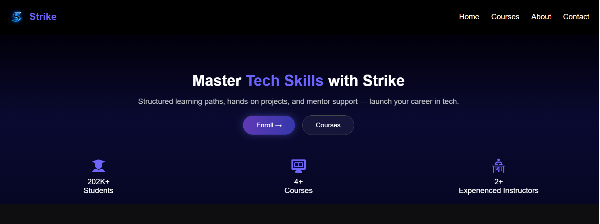

# 🎓 Strike — Course Selling Website

A modern, responsive *course-selling website* built using **HTML and CSS**.  
This project was created for a hackathon to showcase a user-friendly, visually appealing platform for students to browse and purchase courses.

---

## 🖥 Overview

*Strike* is a simple yet professional web design that mimics real-world e-learning platforms.  
It includes sections for featured courses, categories, about us, and contact — all structured using semantic HTML and styled with custom CSS for responsiveness and visual balance.

---
## 💻 Technologies Used

HTML5 — for structure

CSS3 — for styling and responsiveness

---

## 📸 Demo



Link: [https://strike-akansha-htmlcss.netlify.app/]

---

## ✨ Features

- 📚 Multiple course sections with descriptions and details  
- 🎨 Fully responsive design (works on desktop & mobile)  
- 🔗 Smooth navigation using internal links  
- 📩 Contact section with form layout  
- 🧾 Footer with quick links and social icons  
- ⚡ Built entirely with HTML5 and CSS3 — no frameworks  

---
```bash
## 📁 Folder Structure

Hackathon/HTML+CSS/ 
│ 
├── index.html 
├── course.html 
├── contact.html 
├── style.css 
├──  images/
|     ├──aditya-tandon.png
|     ├──rohit-negi.png
|     ├──blue 1.png
|     ├──free-LLD.png
|     ├──free-webDev.png
|     ├──paid-DSA.png
|     ├──paid-genAi.png
|     ├──paid-HLD.png
|     ├──paid-webDev.png
└── courses/ 
    ├── DSA.html
    ├── HLD.html
    ├── Free-WebDev.html
    ├── Paid-Webev.html
    └──genAi.html
```   
---

## 🚀 How to View

1. Clone the repository:
   ```bash
   git clone https://github.com/Akanshavishwakarma/HTML+CSS.git

2. Open the folder in any code editor.

3. Launch index.html in your browser.

---

## 🏆 Hackathon Context

This project was built during a Hackathon event focused on creating multi-page websites using only HTML and CSS.
The aim was to demonstrate clean UI design, navigation flow, and front-end development skills without backend support.


---

## 🧑‍💻 Author

Akansha Vishwakarma

🌍Twiiter [https://x.com/Akanshav_1?t=DR8k-oXCiMwh68Vl88tuyA&s=09]

📧 Linkedin [https://www.linkedin.com/in/akansha-vishwakarma?utm_source=share&utm_campaign=share_via&utm_content=profile&utm_medium=android_app]

🌍 GitHub: [https://github.com/Akanshavishwakarma]


